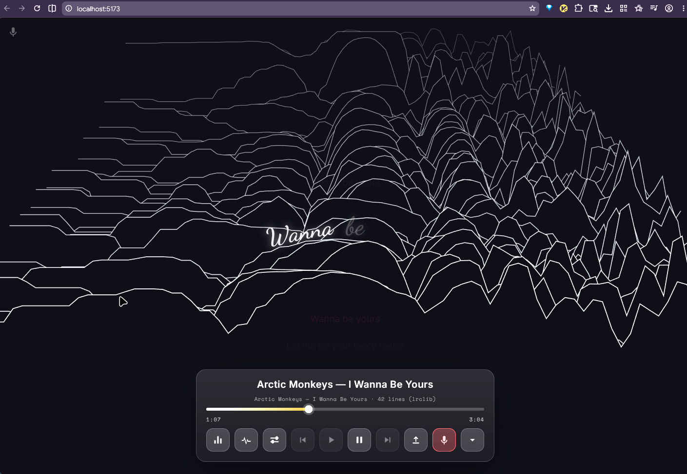
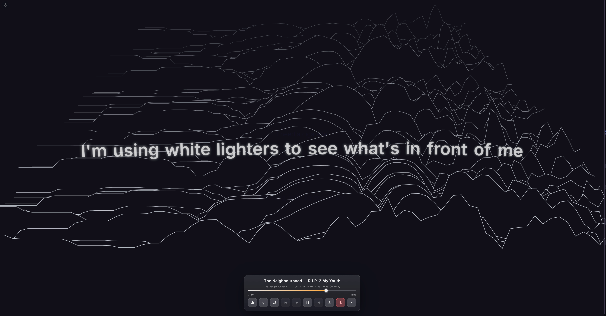

# Audio Visualization with Pretext

Animated music visualization with synced lyrics, built around `@chenglou/pretext` for text measurement and manual line layout.

[](https://nutmeg-vow-nwgm.here.now/)

> Live demo: [nutmeg-vow-nwgm.here.now](https://nutmeg-vow-nwgm.here.now/)
>
> The app starts blank — begin by capturing system audio or loading a song, with synced lyrics, play/pause controls, and a seek bar.



## What This Project Does

This app takes audio plus lyrics and turns the lyric block into an audio-reactive visual system.

It supports:

- local audio upload via drag-and-drop
- optional `.lrc` or `.txt` lyric files
- embedded lyric extraction from audio metadata when available
- lyric lookup from LRCLIB when metadata or filenames are good enough
- beat-driven text manipulation on a canvas background

The renderer is canvas-first. Audio analysis drives the motion system, while Pretext supplies the text layout foundation that keeps the lyric block stable enough to animate aggressively.

## Why Pretext Is Here

Pretext is the core text-layout engine for this project. It is not handling audio playback or lyric fetching. Its job is to make the text layout accurate, deterministic, and cheap enough to manipulate in real time.

Without Pretext, this project would still be a music visualizer, but the lyric system would be much weaker:

- line wrapping would depend on ad hoc `measureText` loops
- word widths would be less stable across fonts and line breaks
- mixed-script and emoji handling would be more brittle
- multi-line lyric shaping would be much harder
- aggressive motion would cause more overlap and layout jitter

With Pretext, the app gets a reliable layout model first, then applies audio-reactive motion on top.

## How We Are Using Pretext

The app currently uses several pieces of the Pretext API, not just the simplest `layoutWithLines` path.

### 1. One-time text preparation

Each lyric string is prepared with:

- `prepareWithSegments(text, font)`

This gives us a cached, segment-aware representation of the text for the current font. We keep those prepared values in a local cache so repeated renders of the same lyric do not redo the expensive analysis pass.

Relevant code:

- [src/main.js](src/main.js)

### 2. Locale-aware segmentation

When lyrics change, we infer a likely locale from the lyric text and call:

- `setLocale(locale)`

This matters because Pretext relies on language-aware segmentation behavior for scripts like CJK, Arabic, Hebrew, and Thai. That makes the line-breaking and segment slicing more correct than English-only space splitting.

### 3. Segment-aware rendering instead of regex tokenization

Earlier versions of this app split `line.text` using regex. The current version uses:

- `line.start`
- `line.end`
- `prepared.segments`

That means the renderer reads the actual cursor ranges returned by Pretext and slices segments by grapheme when a line breaks inside a segment.

This is a big improvement because it respects how Pretext actually laid out the text instead of reconstructing tokens afterward with assumptions that only work well for simple English.

### 4. Width balancing with `walkLineRanges`

The active lyric block does not just accept the widest allowed wrap width.

Instead, it:

1. lays out the lyric once at `maxWidth`
2. captures the target line count
3. uses `walkLineRanges()` to binary-search a tighter width that preserves that same line count

That gives the lyric block a more shrink-wrapped shape and reduces awkward empty space on short last lines.

### 5. Variable-width line routing with `layoutNextLine`

After finding a balanced width, the active lyric block is routed line by line with:

- `layoutNextLine(prepared, cursor, widthForThatLine)`

This lets the app shape the lyric block so middle lines can be slightly narrower than outer lines. The result is a more intentional silhouette than a plain rectangle, while still being fully driven by Pretext’s layout engine.

### 6. Supporting text also uses Pretext

The previous/next context lines and the previous-line fadeout also use Pretext layout rather than raw canvas text placement. That keeps the whole lyric system consistent.

## Rendering Pipeline

At a high level, the app does this:

1. Load audio into the Web Audio API and decode it into an `AudioBuffer`.
2. Analyze spectrum and waveform data with an `AnalyserNode`.
3. Parse or fetch lyrics.
4. Use Pretext to prepare and shape the current lyric line block.
5. Convert Pretext line ranges into renderable segment tokens.
6. Apply beat-driven transforms to those tokens.
7. Draw everything onto canvas.

The important split is:

- audio timing and frequency analysis decide **how** the text moves
- Pretext decides **where the text can safely exist before it moves**

## Current Pretext-Driven Improvements

Compared with the earlier implementation, the renderer now has:

- segment-aware line token extraction
- grapheme-safe slicing for partial segments
- balanced multiline width search
- shaped line routing via per-line width changes
- locale-aware cache resets when lyric language changes

This makes the lyric block more robust for:

- emoji
- mixed punctuation
- Arabic/Hebrew-style scripts
- CJK text
- lines that break inside what used to be treated as a single “word”

## Audio + Lyrics Flow

The project currently supports:

- audio upload
- embedded lyrics from tags
- external `.lrc` / `.txt`
- pasted lyrics
- LRCLIB auto-fetch

The best experience is:

1. upload audio with good metadata, or a clear filename
2. provide timed `.lrc` lyrics when possible

LRCLIB lookup is useful, but it is still a best-effort fallback. True synced LRC will always give the strongest visual result.

## Tech Notes

- Rendering: Canvas 2D
- Layout: `@chenglou/pretext`
- Audio: Web Audio API
- Bundler: Vite
- Lyrics source: local files, embedded tags, LRCLIB fallback

## Run Locally

```bash
npm install
npm run dev
```

Then open the local Vite URL in your browser.

### System "now playing" sync (optional)

The browser sandbox can't read what other apps are playing, so a small local
helper bridges the OS media session to the app:

```bash
npm run build      # the bridge serves the production build from dist/
npm run bridge     # then open http://localhost:8787
```

The bridge reads the current track's **title / artist / album** from the OS and
exposes it at `GET /api/now-playing`. The app polls it, queries lrclib for the
matching lyrics, and syncs the lyric timeline to the live playback position — so
lyrics follow whatever is playing in any player.

Metadata readers per platform:

- **Linux** — MPRIS via `playerctl`
- **macOS** — `nowplaying-cli` (`brew install nowplaying-cli`)
- **Windows** — SMTC via PowerShell (built in)

### System audio capture

The mic button opens a capture-source menu so the spectrum can react to audio
playing outside the app. Sources:

- **System output (bridge)** — appears only when the page is served by the
  bridge on Linux. The bridge taps the default output's monitor with `parec` and
  streams raw PCM at `GET /api/audio?rate=N`, so the visualizer reacts to **any
  native app's audio** (Spotify, Deezer, a desktop player — not just tabs).
- **Browser tab / window** — `getDisplayMedia`; capture a tab/window and tick
  "Share tab audio". Works in-browser without the bridge.
- **Input devices…** — opt-in `getUserMedia` on a monitor / line-in device (asks
  for mic permission; only lists monitors the browser chooses to expose).

**How to use (full system audio, Linux):**

1. `npm run build && npm run bridge`, then open `http://localhost:8787`.
2. Play music in any app.
3. Click the mic button → **System output (bridge)**.
4. Title/artist + lrclib lyrics come from the bridge; the spectrum follows the
   live audio. Click the button again to stop (a faint icon, top-left, shows
   capture is active).

**Limitations:**

- **Bridge PCM capture is Linux-only** (`parec`). On macOS/Windows use tab-share,
  or a loopback device under "Input devices…" (BlackHole on macOS, Stereo Mix /
  VB-Cable on Windows).
- **Mobile browsers can't capture system or tab audio at all** — Android/iOS
  block `getDisplayMedia` audio. A phone can only visualize files loaded into the
  app itself, or use the bridge as a remote display of a desktop.
- **Hosted here.now build:** sends a `microphone=()` permissions policy, so only
  tab-share works there; mic/device capture is blocked. Run the local bridge for
  full system/native-app audio.
- **Capture carries no metadata by itself** — title/artist/lyrics always come
  from the bridge, so lyrics sync only when the bridge is running.

## Controls

The transport is a row of icon buttons (hover for tooltips):

- **Visualizer** — switch between Linebed (default) and Bars + Wave
- **Linebed presets** — Smooth / Dynamic / Custom (amplitude, contrast, velocity,
  gate, flip-Y sliders); see [Visualizers](#visualizers)
- **Play / Pause** and the **seek bar** scrub the track
- **Load** — pick audio and/or `.lrc` / `.txt` lyric files
- **Capture** — open the [system audio capture](#system-audio-capture) menu
- **Minimize** — collapse the player to free the screen

You can also **drag-and-drop** audio or lyric files anywhere on the window.

Supported lyric inputs:

- `.lrc` for synced lyrics
- `.txt` for plain lyrics

Supported audio input is browser-dependent because decoding uses `AudioContext.decodeAudioData`.

## Visualizers

Two modes, toggled with the Visualizer button:

- **Linebed** (default) — a scrolling, fake-3D stack of chromatic spectrum
  snapshots (Joy-Division-style ridges), newest line nearest the viewer. Three
  presets: **Smooth** (gentle), **Dynamic** (high-contrast, volume-reactive), and
  **Custom** (live sliders for amplitude, contrast/gamma, velocity/transient
  punch, noise gate, and Y-flip). The active preset persists in `localStorage`.
- **Bars + Wave** — classic frequency bars plus a waveform trace.

## Screenshots

The screenshots below were captured from a real local run of the app, using a local audio upload so the visuals reflect the actual audio + lyric pipeline rather than a mocked frame.


### Pretext screenshot



## Walkthrough

If generated successfully, the walkthrough video is stored here:

- [docs/video/walkthrough.mp4](docs/video/walkthrough.mp4)

## File Map

- `src/main.js`: main render loop, UI wiring, Pretext integration, lyric drawing, visualizers, capture menu
- `src/audio.js`: audio loading, playback, analyser metrics, live capture (tab / device / bridge PCM stream)
- `src/beat-detect.js`: beat and motion-state extraction
- `src/lrc-parser.js`: LRC/plain-text lyric parsing
- `src/lyrics-fetch.js`: LRCLIB search and scoring
- `src/now-playing-bridge.js`: client for the local now-playing bridge
- `bridge/now-playing-bridge.mjs`: local bridge — OS metadata + system-audio PCM stream + static server
- `index.html`: UI shell and controls

## Limitations

- lyric fetch quality depends on metadata or filename quality
- plain text lyrics are auto-timed, not truly synced
- browser audio support varies by codec
- the current visual system is canvas-based, so glyphs are still drawn with canvas text APIs after layout

## Summary

Pretext is the reason this project can behave like a text visualizer instead of a canvas demo with subtitles.

It gives the app:

- reliable line breaking
- width-aware shaping
- segment/cursor data for manual rendering
- a stable basis for aggressive beat-driven motion

That is the core reason the lyric block can move this much without collapsing into unreadable overlap.
